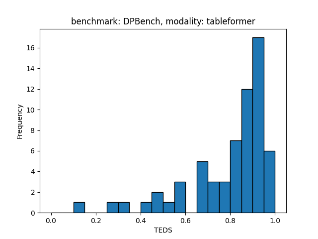
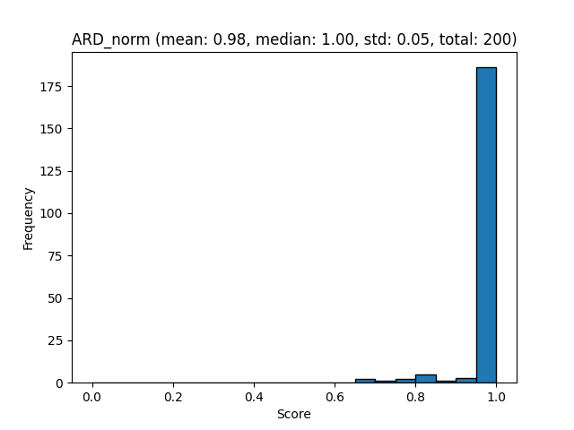
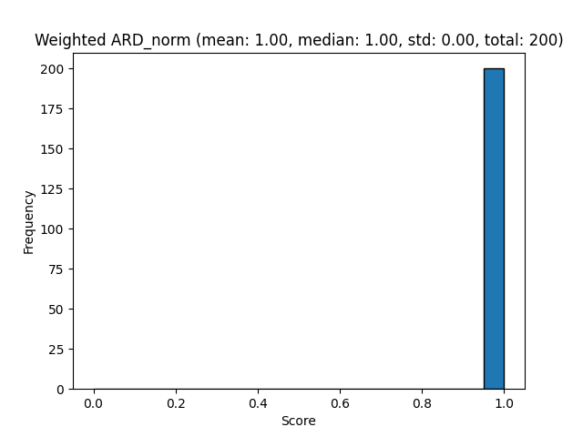
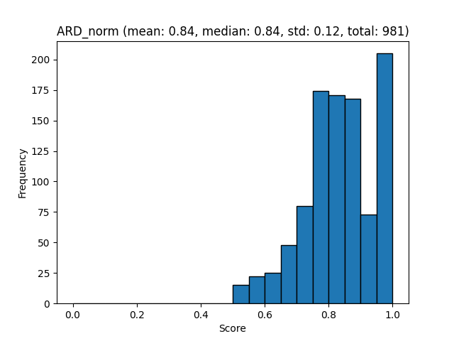
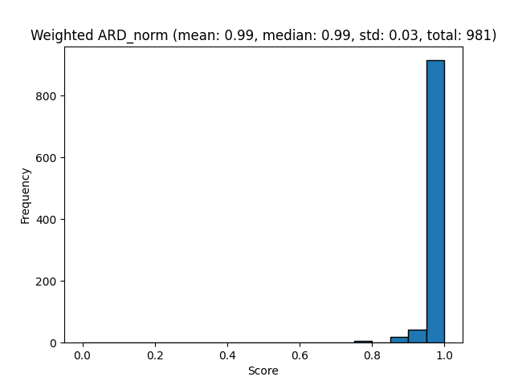

# Docling-eval


[](https://arxiv.org/abs/2408.09869)
[](https://ds4sd.github.io/docling/)
[](https://pypi.org/project/docling/)
[](https://pypi.org/project/docling/)
[](https://python-poetry.org/)
[](https://github.com/psf/black)
[](https://pycqa.github.io/isort/)
[](https://pydantic.dev)
[](https://github.com/pre-commit/pre-commit)
[](https://opensource.org/licenses/MIT)
[](https://pepy.tech/projects/docling)

Evaluate [Docling](https://github.com/DS4SD/docling) on various datasets.

## Features

Evaluate docling on various datasets. You can use the cli

```sh
docling-eval % poetry run evaluate --help
2024-12-20 10:51:57,593 - INFO - PyTorch version 2.5.1 available.

 Usage: evaluate [OPTIONS]

╭─ Options ───────────────────────────────────────────────────────────────────────────────────────────────────────────────────────────────────────────────────────────────────────────────────────────────────────────────────────────────────╮
│ *  --task        -t      [create|evaluate|visualize]                                                                Evaluation task [default: None] [required]                                                                              │
│ *  --modality    -m      [end-to-end|layout|tableformer|codeformer]                                                 Evaluation modality [default: None] [required]                                                                          │
│ *  --benchmark   -b      [DPBench|OmniDcoBench|WordScape|PubLayNet|DocLayNet|Pub1M|PubTabNet|FinTabNet|WikiTabNet]  Benchmark name [default: None] [required]                                                                               │
│ *  --input-dir   -i      PATH                                                                                       Input directory [default: None] [required]                                                                              │
│ *  --output-dir  -o      PATH                                                                                       Output directory [default: None] [required]                                                                             │
│    --help                                                                                                           Show this message and exit.                                                                                             │
╰─────────────────────────────────────────────────────────────────────────────────────────────────────────────────────────────────────────────────────────────────────────────────────────────────────────────────────────────────────────────╯
```

## End to End examples

### DP-Bench

Using a single command,

```sh
poetry run python ./docs/examples/benchmark_dpbench.py
```

This command downloads the DP-Bench dataset, runs the evaluations and produces the following files:

<details>
<summary><b>Layout evaluation</b></summary>
<br>

- [Layout evaluation json](docs/evaluations/DPBench/evaluation_DPBench_layout.json)
- [mAP[0.5:0.95] report](docs/evaluations/DPBench/evaluation_DPBench_layout_mAP[0.5_0.95].txt)
- [mAP[0.5:0.95] plot](docs/evaluations/DPBench/evaluation_DPBench_layout_mAP[0.5_0.95].png)

</details>

<details>
<summary><b>Tableformer evaluation</b></summary>
<br>

- [Tableformer evaluation json](docs/evaluations/DPBench/evaluation_DPBench_tableformer.json)
- [TEDS plot](docs/evaluations/DPBench/evaluation_DPBench_tableformer-delta_row_col.png)
- [TEDS struct only plot](docs/evaluations/DPBench/evaluation_DPBench_tableformer_TEDS_struct-only.png)
- [TEDS struct only report](docs/evaluations/DPBench/evaluation_DPBench_tableformer_TEDS_struct-only.txt)
- [TEDS struct with text plot](docs/evaluations/DPBench/evaluation_DPBench_tableformer_TEDS_struct-with-text.png)
- [TEDS struct with text report](docs/evaluations/DPBench/evaluation_DPBench_tableformer_TEDS_struct-with-text.txt)
</details>

<details>
<summary><b>Reading order evaluation</b></summary>
<br>

- [Reading order json](docs/evaluations/DPBench/evaluation_DPBench_reading_order.json)
- [ARD plot](docs/evaluations/DPBench/evaluation_DPBench_reading_order_ARD_norm.png)
- [ARD report](docs/evaluations/DPBench/evaluation_DPBench_reading_order_ARD_norm.txt)
- [Weighted ARD plot](docs/evaluations/DPBench/evaluation_DPBench_reading_order_weighted_ARD.png)
- [Weighte ARD report](docs/evaluations/DPBench/evaluation_DPBench_reading_order_weighted_ARD.txt)
</details>

<details>
<summary><b>Markdown text evaluation</b></summary>
<br>

- [Markdown text json](docs/evaluations/DPBench/evaluation_DPBench_markdown_text.json)
- [BLEU plot](docs/evaluations/DPBench/evaluation_DPBench_markdown_text_BLEU.png)
- [BLEU report](docs/evaluations/DPBench/evaluation_DPBench_markdown_text_BLEU.txt)
</details>


<!-- 
<details>
<summary><b>Layout evaluation for DP-Bench</b></summary>
<br>

👉 Create the dataset,

```sh
poetry run evaluate -t create -m layout -b DPBench -i <location-of-dpbench> -o ./benchmarks/dpbench-layout
```

👉 Evaluate the dataset,

```sh
poetry run evaluate -t evaluate -m layout -b DPBench -i ./benchmarks/dpbench-layout -o ./benchmarks/dpbench-layout
```

| label          |   Class mAP[0.5:0.95] |
|----------------|-----------------------|
| table          |                 89.08 |
| picture        |                 76.1  |
| document_index |                 75.52 |
| text           |                 67.8  |
| caption        |                 45.8  |
| section_header |                 44.26 |
| page_footer    |                 34.42 |
| list_item      |                 29.04 |
| footnote       |                 22.08 |
| page_header    |                 15.11 |
| formula        |                  6.62 |
</details>

<details>
<summary><b>Table evaluations for DP-Bench</b></summary>
<br>

👉 Create the dataset,

```sh
poetry run evaluate -t create -m tableformer -b DPBench -i ./benchmarks/dpbench-original -o ./benchmarks/dpbench-dataset/tableformer
```

👉 Evaluate the dataset,

```sh
poetry run evaluate -t evaluate -m tableformer -b DPBench -i ./benchmarks/dpbench-dataset/tableformer -o ./benchmarks/dpbench-dataset/tableformer
```

👉 Visualise the dataset,

```sh
poetry run evaluate -t visualize -m tableformer -b DPBench -i ./benchmarks/dpbench-dataset/tableformer -o ./benchmarks/dpbench-dataset/tableformer
```

The final result can be visualised as,


</details>


<details>
<summary><b>Reading order evaluations for DP-Bench</b></summary>
<br>

👉 Evaluate the dataset,

```sh
poetry run evaluate -t evaluate -m reading_order -b DPBench -i ./benchmarks/dpbench-layout -o ./benchmarks/dpbench-layout
```

👉 Visualise the reading order evaluations,

```sh
poetry run evaluate -t visualize -m reading_order -b DPBench -i ./benchmarks/dpbench-layout -o ./benchmarks/dpbench-layout
```

Reading order (Norm Average Relative Distance) [mean|median|std]: [0.98|1.00|0.05]

|   x0<=ARD |   ARD<=x1 |   prob [%] |   acc [%] |   1-acc [%] |   total |
|-----------|-----------|------------|-----------|-------------|---------|
|      0    |      0.05 |        0   |       0   |       100   |       0 |
|      0.05 |      0.1  |        0   |       0   |       100   |       0 |
|      0.1  |      0.15 |        0   |       0   |       100   |       0 |
|      0.15 |      0.2  |        0   |       0   |       100   |       0 |
|      0.2  |      0.25 |        0   |       0   |       100   |       0 |
|      0.25 |      0.3  |        0   |       0   |       100   |       0 |
|      0.3  |      0.35 |        0   |       0   |       100   |       0 |
|      0.35 |      0.4  |        0   |       0   |       100   |       0 |
|      0.4  |      0.45 |        0   |       0   |       100   |       0 |
|      0.45 |      0.5  |        0   |       0   |       100   |       0 |
|      0.5  |      0.55 |        0   |       0   |       100   |       0 |
|      0.55 |      0.6  |        0   |       0   |       100   |       0 |
|      0.6  |      0.65 |        0   |       0   |       100   |       0 |
|      0.65 |      0.7  |        1   |       0   |       100   |       2 |
|      0.7  |      0.75 |        0.5 |       1   |        99   |       1 |
|      0.75 |      0.8  |        1   |       1.5 |        98.5 |       2 |
|      0.8  |      0.85 |        2.5 |       2.5 |        97.5 |       5 |
|      0.85 |      0.9  |        0.5 |       5   |        95   |       1 |
|      0.9  |      0.95 |        1.5 |       5.5 |        94.5 |       3 |
|      0.95 |      1    |       93   |       7   |        93   |     186 |




Reading order (Weighted Normalized Average Relative Distance) [mean|median|std]: [1.00|1.00|0.00]

|   x0<=Weighted ARD |   Weighted ARD<=x1 |   prob [%] |   acc [%] |   1-acc [%] |   total |
|--------------------|--------------------|------------|-----------|-------------|---------|
|               0    |               0.05 |          0 |         0 |         100 |       0 |
|               0.05 |               0.1  |          0 |         0 |         100 |       0 |
|               0.1  |               0.15 |          0 |         0 |         100 |       0 |
|               0.15 |               0.2  |          0 |         0 |         100 |       0 |
|               0.2  |               0.25 |          0 |         0 |         100 |       0 |
|               0.25 |               0.3  |          0 |         0 |         100 |       0 |
|               0.3  |               0.35 |          0 |         0 |         100 |       0 |
|               0.35 |               0.4  |          0 |         0 |         100 |       0 |
|               0.4  |               0.45 |          0 |         0 |         100 |       0 |
|               0.45 |               0.5  |          0 |         0 |         100 |       0 |
|               0.5  |               0.55 |          0 |         0 |         100 |       0 |
|               0.55 |               0.6  |          0 |         0 |         100 |       0 |
|               0.6  |               0.65 |          0 |         0 |         100 |       0 |
|               0.65 |               0.7  |          0 |         0 |         100 |       0 |
|               0.7  |               0.75 |          0 |         0 |         100 |       0 |
|               0.75 |               0.8  |          0 |         0 |         100 |       0 |
|               0.8  |               0.85 |          0 |         0 |         100 |       0 |
|               0.85 |               0.9  |          0 |         0 |         100 |       0 |
|               0.9  |               0.95 |          0 |         0 |         100 |       0 |
|               0.95 |               1    |        100 |         0 |         100 |     200 |




Additionally, images with the actual reading order visualizations are placed in: `benchmarks/dpbench-layout/reading_order_viz`
</details>


<details>
<summary><b>Markdown text evaluations for DP-Bench</b></summary>
<br>

👉 Evaluate the dataset,

```sh
poetry run evaluate -t evaluate -m markdown_text -b DPBench -i ./benchmarks/dpbench-layout -o ./benchmarks/dpbench-layout
```

👉 Visualise the markdown text evaluations,

```sh
poetry run evaluate -t visualize -m markdown_text -b DPBench -i ./benchmarks/dpbench-layout -o ./benchmarks/dpbench-layout
```

Markdown text (BLEU) [mean|median|std]: [0.81|0.87|0.20]

|   x0<=BlEU |   BlEU<=x1 |   prob [%] |   acc [%] |   1-acc [%] |   total |
|------------|------------|------------|-----------|-------------|---------|
|       0    |       0.05 |        1   |       0   |       100   |       2 |
|       0.05 |       0.1  |        0.5 |       1   |        99   |       1 |
|       0.1  |       0.15 |        0.5 |       1.5 |        98.5 |       1 |
|       0.15 |       0.2  |        1.5 |       2   |        98   |       3 |
|       0.2  |       0.25 |        1   |       3.5 |        96.5 |       2 |
|       0.25 |       0.3  |        0   |       4.5 |        95.5 |       0 |
|       0.3  |       0.35 |        0.5 |       4.5 |        95.5 |       1 |
|       0.35 |       0.4  |        0   |       5   |        95   |       0 |
|       0.4  |       0.45 |        0.5 |       5   |        95   |       1 |
|       0.45 |       0.5  |        0.5 |       5.5 |        94.5 |       1 |
|       0.5  |       0.55 |        3.5 |       6   |        94   |       7 |
|       0.55 |       0.6  |        1   |       9.5 |        90.5 |       2 |
|       0.6  |       0.65 |        4   |      10.5 |        89.5 |       8 |
|       0.65 |       0.7  |        2   |      14.5 |        85.5 |       4 |
|       0.7  |       0.75 |        3.5 |      16.5 |        83.5 |       7 |
|       0.75 |       0.8  |       10   |      20   |        80   |      20 |
|       0.8  |       0.85 |        9.5 |      30   |        70   |      19 |
|       0.85 |       0.9  |       21   |      39.5 |        60.5 |      42 |
|       0.9  |       0.95 |       22.5 |      60.5 |        39.5 |      45 |
|       0.95 |       1    |       17   |      83   |        17   |      34 |

The above quantiles have been also visualized as a histogram plot in: `benchmarks/dpbench-layout/evaluation_DPBench_markdown_text.png`

</details>
-->


### OmniDocBench

Using a single command,

```sh
poetry run python ./docs/examples/benchmark_omnidocbench.py
```

This command downloads runs the evaluations and produces the following files:

<details>
<summary><b>Layout evaluation</b></summary>
<br>

- [Layout evaluation json](docs/evaluations/OmniDocBench/evaluation_OmniDocBench_layout.json)
- [mAP[0.5:0.95] report](docs/evaluations/OmniDocBench/evaluation_OmniDocBench_layout_mAP[0.5_0.95].txt)
- [mAP[0.5:0.95] plot](docs/evaluations/OmniDocBench/evaluation_OmniDocBench_layout_mAP[0.5_0.95].png)
</details>

<details>
<summary><b>Tableformer evaluation</b></summary>
<br>

- [Tableformer evaluation json](docs/evaluations/OmniDocBench/evaluation_OmniDocBench_tableformer.json)
- [TEDS plot](docs/evaluations/OmniDocBench/evaluation_OmniDocBench_tableformer-delta_row_col.png)
- [TEDS struct only plot](docs/evaluations/OmniDocBench/evaluation_OmniDocBench_tableformer_TEDS_struct-only.png)
- [TEDS struct only report](docs/evaluations/OmniDocBench/evaluation_OmniDocBench_tableformer_TEDS_struct-only.txt)
- [TEDS struct with text plot](docs/evaluations/OmniDocBench/evaluation_OmniDocBench_tableformer_TEDS_struct-with-text.png)
- [TEDS struct with text report](docs/evaluations/OmniDocBench/evaluation_OmniDocBench_tableformer_TEDS_struct-with-text.txt)

</details>

<details>
<summary><b>Reading order evaluation</b></summary>
<br>

- [Reading order json](docs/evaluations/OmniDocBench/evaluation_OmniDocBench_reading_order.json)
- [ARD plot](docs/evaluations/OmniDocBench/evaluation_OmniDocBench_reading_order_ARD_norm.png)
- [ARD report](docs/evaluations/OmniDocBench/evaluation_OmniDocBench_reading_order_ARD_norm.txt)
- [Weighted ARD plot](docs/evaluations/OmniDocBench/evaluation_OmniDocBench_reading_order_weighted_ARD.png)
- [Weighte ARD report](docs/evaluations/OmniDocBench/evaluation_OmniDocBench_reading_order_weighted_ARD.txt)

</details>

<details>
<summary><b>Markdown text evaluation</b></summary>
<br>

- [Markdown text json](docs/evaluations/OmniDocBench/evaluation_OmniDocBench_markdown_text.json)
- [BLEU plot](docs/evaluations/OmniDocBench/evaluation_OmniDocBench_markdown_text_BLEU.png)
- [BLEU report](docs/evaluations/OmniDocBench/evaluation_OmniDocBench_markdown_text_BLEU.txt)

</details>

<!--
<details>
<summary><b>Layout evaluation for OmniDocBench</b></summary>
<br>

👉 Create the dataset,

```sh
poetry run evaluate -t create -m layout -b OmniDocBench -i ./benchmarks/omnidocbench-original -o ./benchmarks/omnidocbench-dataset/layout
```

👉 Evaluate the dataset,

```sh
poetry run evaluate -t evaluate -m layout -b OmniDocBench -i ./benchmarks/omnidocbench-dataset/layout -o ./benchmarks/omnidocbench-dataset/layout
```

👉 Visualise the dataset,

```sh
poetry run evaluate -t visualize -m tableformer -b OmniDocBench -i ./benchmarks/OmniDocBench-dataset/layout -o ./benchmarks/OmniDocBench-dataset/layout
```

| label          |   Class mAP[0.5:0.95] |
|----------------|-----------------------|
| table          |                 69.32 |
| picture        |                 29.29 |
| text           |                 23.99 |
| page_footer    |                 16.14 |
| section_header |                 13.09 |
| caption        |                 10.74 |
| page_header    |                 10.02 |
| formula        |                  3.83 |
| footnote       |                  2.48 |
</details>

<details>
<summary><b>Table evaluations for OmniDocBench</b></summary>
<br>

👉 Create the dataset,

```sh
poetry run evaluate -t create -m tableformer -b OmniDocBench -i ./benchmarks/omnidocbench-original -o ./benchmarks/omnidocbench-dataset/tableformer
```

👉 Evaluate the dataset,

```sh
poetry run evaluate -t evaluate -m tableformer -b OmniDocBench -i ./benchmarks/omnidocbench-dataset/tableformer -o ./benchmarks/omnidocbench-dataset/tableformer
```

👉 Visualise the dataset,

```sh
poetry run evaluate -t visualize -m tableformer -b OmniDocBench -i ./benchmarks/OmniDocBench-dataset/tableformer -o ./benchmarks/OmniDocBench-dataset/tableformer
```

The final result can be visualised as,

|   x0<=TEDS |   TEDS<=x1 |   prob [%] |   acc [%] |   1-acc [%] |   total |
|------------|------------|------------|-----------|-------------|---------|
|       0    |       0.05 |       0.61 |      0    |      100    |       2 |
|       0.05 |       0.1  |       0    |      0.61 |       99.39 |       0 |
|       0.1  |       0.15 |       0.61 |      0.61 |       99.39 |       2 |
|       0.15 |       0.2  |       0    |      1.21 |       98.79 |       0 |
|       0.2  |       0.25 |       0.3  |      1.21 |       98.79 |       1 |
|       0.25 |       0.3  |       1.21 |      1.52 |       98.48 |       4 |
|       0.3  |       0.35 |       2.12 |      2.73 |       97.27 |       7 |
|       0.35 |       0.4  |       0.91 |      4.85 |       95.15 |       3 |
|       0.4  |       0.45 |       0.91 |      5.76 |       94.24 |       3 |
|       0.45 |       0.5  |       0.91 |      6.67 |       93.33 |       3 |
|       0.5  |       0.55 |       2.12 |      7.58 |       92.42 |       7 |
|       0.55 |       0.6  |       3.03 |      9.7  |       90.3  |      10 |
|       0.6  |       0.65 |       3.33 |     12.73 |       87.27 |      11 |
|       0.65 |       0.7  |       3.94 |     16.06 |       83.94 |      13 |
|       0.7  |       0.75 |       7.27 |     20    |       80    |      24 |
|       0.75 |       0.8  |       6.97 |     27.27 |       72.73 |      23 |
|       0.8  |       0.85 |      13.33 |     34.24 |       65.76 |      44 |
|       0.85 |       0.9  |      13.33 |     47.58 |       52.42 |      44 |
|       0.9  |       0.95 |      22.12 |     60.91 |       39.09 |      73 |
|       0.95 |       1    |      16.97 |     83.03 |       16.97 |      56 |
</details>

<details>
<summary><b>Reading order evaluations for OmniDocBench</b></summary>
<br>

👉 Evaluate the dataset,

```sh
poetry run evaluate -t evaluate -m reading_order -b OmniDocBench -i ./benchmarks/omnidocbench-dataset/layout -o ./benchmarks/omnidocbench-dataset/layout
```

👉 Visualise the reading order evaluations,

```sh
poetry run evaluate -t visualize -m reading_order -b OmniDocBench -i ./benchmarks/omnidocbench-dataset/layout -o ./benchmarks/omnidocbench-dataset/layout 
```

Reading order (Norm Average Relative Distance) [mean|median|std]: [0.84|0.84|0.12]

|   x0<=ARD |   ARD<=x1 |   prob [%] |   acc [%] |   1-acc [%] |   total |
|-----------|-----------|------------|-----------|-------------|---------|
|      0    |      0.05 |       0    |      0    |      100    |       0 |
|      0.05 |      0.1  |       0    |      0    |      100    |       0 |
|      0.1  |      0.15 |       0    |      0    |      100    |       0 |
|      0.15 |      0.2  |       0    |      0    |      100    |       0 |
|      0.2  |      0.25 |       0    |      0    |      100    |       0 |
|      0.25 |      0.3  |       0    |      0    |      100    |       0 |
|      0.3  |      0.35 |       0    |      0    |      100    |       0 |
|      0.35 |      0.4  |       0    |      0    |      100    |       0 |
|      0.4  |      0.45 |       0    |      0    |      100    |       0 |
|      0.45 |      0.5  |       0    |      0    |      100    |       0 |
|      0.5  |      0.55 |       1.53 |      0    |      100    |      15 |
|      0.55 |      0.6  |       2.24 |      1.53 |       98.47 |      22 |
|      0.6  |      0.65 |       2.55 |      3.77 |       96.23 |      25 |
|      0.65 |      0.7  |       4.89 |      6.32 |       93.68 |      48 |
|      0.7  |      0.75 |       8.15 |     11.21 |       88.79 |      80 |
|      0.75 |      0.8  |      17.74 |     19.37 |       80.63 |     174 |
|      0.8  |      0.85 |      17.43 |     37.1  |       62.9  |     171 |
|      0.85 |      0.9  |      17.13 |     54.54 |       45.46 |     168 |
|      0.9  |      0.95 |       7.44 |     71.66 |       28.34 |      73 |
|      0.95 |      1    |      20.9  |     79.1  |       20.9  |     205 |




Reading order (Weighted Normalized Average Relative Distance) [mean|median|std]: [0.99|0.99|0.03]

|   x0<=Weighted ARD |   Weighted ARD<=x1 |   prob [%] |   acc [%] |   1-acc [%] |   total |
|--------------------|--------------------|------------|-----------|-------------|---------|
|               0    |               0.05 |       0    |      0    |      100    |       0 |
|               0.05 |               0.1  |       0    |      0    |      100    |       0 |
|               0.1  |               0.15 |       0    |      0    |      100    |       0 |
|               0.15 |               0.2  |       0    |      0    |      100    |       0 |
|               0.2  |               0.25 |       0    |      0    |      100    |       0 |
|               0.25 |               0.3  |       0    |      0    |      100    |       0 |
|               0.3  |               0.35 |       0    |      0    |      100    |       0 |
|               0.35 |               0.4  |       0    |      0    |      100    |       0 |
|               0.4  |               0.45 |       0    |      0    |      100    |       0 |
|               0.45 |               0.5  |       0    |      0    |      100    |       0 |
|               0.5  |               0.55 |       0    |      0    |      100    |       0 |
|               0.55 |               0.6  |       0    |      0    |      100    |       0 |
|               0.6  |               0.65 |       0    |      0    |      100    |       0 |
|               0.65 |               0.7  |       0    |      0    |      100    |       0 |
|               0.7  |               0.75 |       0    |      0    |      100    |       0 |
|               0.75 |               0.8  |       0.61 |      0    |      100    |       6 |
|               0.8  |               0.85 |       0    |      0.61 |       99.39 |       0 |
|               0.85 |               0.9  |       1.83 |      0.61 |       99.39 |      18 |
|               0.9  |               0.95 |       4.28 |      2.45 |       97.55 |      42 |
|               0.95 |               1    |      93.27 |      6.73 |       93.27 |     915 |



</details>


<details>
<summary><b>Markdown text evaluations for OmniDocBench</b></summary>
<br>

👉 Evaluate the dataset,

```sh
poetry run evaluate -t evaluate -m markdown_text -b OmniDocBench -i ./benchmarks/omnidocbench-dataset/layout -o ./benchmarks/omnidocbench-dataset/layout
```

👉 Visualise the markdown text evaluations,

```sh
poetry run evaluate -t visualize -m markdown_text -b OmniDocBench -i ./benchmarks/omnidocbench-dataset/layout -o ./benchmarks/omnidocbench-dataset/layout
```

Markdown text (BLEU) [mean|median|std]: [0.30|0.11|0.33]

|   x0<=BlEU |   BlEU<=x1 |   prob [%] |   acc [%] |   1-acc [%] |   total |
|------------|------------|------------|-----------|-------------|---------|
|       0    |       0.05 |      41.59 |      0    |      100    |     408 |
|       0.05 |       0.1  |       6.83 |     41.59 |       58.41 |      67 |
|       0.1  |       0.15 |       4.18 |     48.42 |       51.58 |      41 |
|       0.15 |       0.2  |       3.26 |     52.6  |       47.4  |      32 |
|       0.2  |       0.25 |       2.45 |     55.86 |       44.14 |      24 |
|       0.25 |       0.3  |       1.83 |     58.31 |       41.69 |      18 |
|       0.3  |       0.35 |       1.83 |     60.14 |       39.86 |      18 |
|       0.35 |       0.4  |       2.04 |     61.98 |       38.02 |      20 |
|       0.4  |       0.45 |       2.04 |     64.02 |       35.98 |      20 |
|       0.45 |       0.5  |       2.55 |     66.06 |       33.94 |      25 |
|       0.5  |       0.55 |       2.04 |     68.6  |       31.4  |      20 |
|       0.55 |       0.6  |       2.04 |     70.64 |       29.36 |      20 |
|       0.6  |       0.65 |       2.75 |     72.68 |       27.32 |      27 |
|       0.65 |       0.7  |       2.96 |     75.43 |       24.57 |      29 |
|       0.7  |       0.75 |       4.69 |     78.39 |       21.61 |      46 |
|       0.75 |       0.8  |       4.28 |     83.08 |       16.92 |      42 |
|       0.8  |       0.85 |       4.79 |     87.36 |       12.64 |      47 |
|       0.85 |       0.9  |       4.59 |     92.15 |        7.85 |      45 |
|       0.9  |       0.95 |       2.65 |     96.74 |        3.26 |      26 |
|       0.95 |       1    |       0.61 |     99.39 |        0.61 |       6 |

The above quantiles have been also visualized as a histogram plot in: `benchmarks/omnidocbench-dataset/layout/evaluation_OmniDocBench_markdown_text.png`

</details>
-->


### FinTabNet

Using a single command (loading the dataset from Huggingface: [FinTabNet_OTSL](https://huggingface.co/datasets/ds4sd/FinTabNet_OTSL)),

```sh
poetry run python ./docs/examples/benchmark_fintabnet.py
```

<details>
<summary><b>Table evaluations for FinTabNet</b></summary>
<br>

👉 Evaluate the dataset,

```sh
poetry run evaluate -t evaluate -m tableformer -b FinTabNet -i ./benchmarks/fintabnet-dataset/tableformer -o ./benchmarks/fintabnet-dataset/tableformer
```

👉 Visualise the dataset,

```sh
poetry run evaluate -t visualize -m tableformer -b FinTabNet -i ./benchmarks/fintabnet-dataset/tableformer -o ./benchmarks/fintabnet-dataset/tableformer
```

The final result (struct only here) can be visualised as,

|   x0<=TEDS |   TEDS<=x1 |   prob [%] |   acc [%] |   1-acc [%] |   total |
|------------|------------|------------|-----------|-------------|---------|
|       0    |       0.05 |        0   |       0   |       100   |       0 |
|       0.05 |       0.1  |        0   |       0   |       100   |       0 |
|       0.1  |       0.15 |        0   |       0   |       100   |       0 |
|       0.15 |       0.2  |        0.2 |       0   |       100   |       2 |
|       0.2  |       0.25 |        0   |       0.2 |        99.8 |       0 |
|       0.25 |       0.3  |        0   |       0.2 |        99.8 |       0 |
|       0.3  |       0.35 |        0   |       0.2 |        99.8 |       0 |
|       0.35 |       0.4  |        0   |       0.2 |        99.8 |       0 |
|       0.4  |       0.45 |        0   |       0.2 |        99.8 |       0 |
|       0.45 |       0.5  |        0   |       0.2 |        99.8 |       0 |
|       0.5  |       0.55 |        0.3 |       0.2 |        99.8 |       3 |
|       0.55 |       0.6  |        0.5 |       0.5 |        99.5 |       5 |
|       0.6  |       0.65 |        0.7 |       1   |        99   |       7 |
|       0.65 |       0.7  |        0.6 |       1.7 |        98.3 |       6 |
|       0.7  |       0.75 |        1.5 |       2.3 |        97.7 |      15 |
|       0.75 |       0.8  |        3.3 |       3.8 |        96.2 |      33 |
|       0.8  |       0.85 |       15.3 |       7.1 |        92.9 |     153 |
|       0.85 |       0.9  |       19   |      22.4 |        77.6 |     190 |
|       0.9  |       0.95 |       30.7 |      41.4 |        58.6 |     307 |
|       0.95 |       1    |       27.9 |      72.1 |        27.9 |     279 |
</details>

### Pub1M

Using a single command (loading the dataset from Huggingface: [Pub1M_OTSL](https://huggingface.co/datasets/ds4sd/Pub1M_OTSL)),

```sh
poetry run python ./docs/examples/benchmark_p1m.py
```

<details>
<summary><b>Table evaluations for Pub1M</b></summary>
<br>

👉 Evaluate the dataset,

```sh
poetry run evaluate -t evaluate -m tableformer -b Pub1M -i ./benchmarks/Pub1M-dataset/tableformer -o ./benchmarks/Pub1M-dataset/tableformer
```

👉 Visualise the dataset,

```sh
poetry run evaluate -t visualize -m tableformer -b Pub1M -i ./benchmarks/Pub1M-dataset/tableformer -o ./benchmarks/Pub1M-dataset/tableformer
```

|   x0<=TEDS |   TEDS<=x1 |   prob [%] |   acc [%] |   1-acc [%] |   total |
|------------|------------|------------|-----------|-------------|---------|
|       0    |       0.05 |        1.3 |       0   |       100   |      13 |
|       0.05 |       0.1  |        0.8 |       1.3 |        98.7 |       8 |
|       0.1  |       0.15 |        0.2 |       2.1 |        97.9 |       2 |
|       0.15 |       0.2  |        0.2 |       2.3 |        97.7 |       2 |
|       0.2  |       0.25 |        0   |       2.5 |        97.5 |       0 |
|       0.25 |       0.3  |        0   |       2.5 |        97.5 |       0 |
|       0.3  |       0.35 |        0.3 |       2.5 |        97.5 |       3 |
|       0.35 |       0.4  |        0   |       2.8 |        97.2 |       0 |
|       0.4  |       0.45 |        0.1 |       2.8 |        97.2 |       1 |
|       0.45 |       0.5  |        0.3 |       2.9 |        97.1 |       3 |
|       0.5  |       0.55 |        0.8 |       3.2 |        96.8 |       8 |
|       0.55 |       0.6  |        1.6 |       4   |        96   |      16 |
|       0.6  |       0.65 |        1.6 |       5.6 |        94.4 |      16 |
|       0.65 |       0.7  |        2.3 |       7.2 |        92.8 |      23 |
|       0.7  |       0.75 |        4.6 |       9.5 |        90.5 |      46 |
|       0.75 |       0.8  |       10.8 |      14.1 |        85.9 |     108 |
|       0.8  |       0.85 |       15.3 |      24.9 |        75.1 |     153 |
|       0.85 |       0.9  |       21.6 |      40.2 |        59.8 |     216 |
|       0.9  |       0.95 |       22.9 |      61.8 |        38.2 |     229 |
|       0.95 |       1    |       15.3 |      84.7 |        15.3 |     153 |
</details>

### PubTabNet

Using a single command (loading the dataset from Huggingface: [Pubtabnet_OTSL](https://huggingface.co/datasets/ds4sd/Pubtabnet_OTSL)),

```sh
poetry run python ./docs/examples/benchmark_pubtabnet.py
```

<details>
<summary><b>Table evaluations for Pubtabnet</b></summary>
<br>

👉 Evaluate the dataset,

```sh
poetry run evaluate -t evaluate -m tableformer -b Pubtabnet -i ./benchmarks/pubtabnet-dataset/tableformer -o ./benchmarks/pubtabnet-dataset/tableformer
```

👉 Visualise the dataset,

```sh
poetry run evaluate -t visualize -m tableformer -b Pubtabnet -i ./benchmarks/pubtabnet-dataset/tableformer -o ./benchmarks/pubtabnet-dataset/tableformer
```

The final result (struct only here) can be visualised as,

|   x0<=TEDS |   TEDS<=x1 |   prob [%] |   acc [%] |   1-acc [%] |   total |
|------------|------------|------------|-----------|-------------|---------|
|       0    |       0.05 |       0    |      0    |      100    |       0 |
|       0.05 |       0.1  |       0.01 |      0    |      100    |       1 |
|       0.1  |       0.15 |       0.01 |      0.01 |       99.99 |       1 |
|       0.15 |       0.2  |       0.02 |      0.02 |       99.98 |       2 |
|       0.2  |       0.25 |       0    |      0.04 |       99.96 |       0 |
|       0.25 |       0.3  |       0    |      0.04 |       99.96 |       0 |
|       0.3  |       0.35 |       0    |      0.04 |       99.96 |       0 |
|       0.35 |       0.4  |       0    |      0.04 |       99.96 |       0 |
|       0.4  |       0.45 |       0.02 |      0.04 |       99.96 |       2 |
|       0.45 |       0.5  |       0.1  |      0.06 |       99.94 |      10 |
|       0.5  |       0.55 |       0.1  |      0.15 |       99.85 |      10 |
|       0.55 |       0.6  |       0.24 |      0.25 |       99.75 |      25 |
|       0.6  |       0.65 |       0.47 |      0.49 |       99.51 |      49 |
|       0.65 |       0.7  |       1.04 |      0.96 |       99.04 |     108 |
|       0.7  |       0.75 |       2.44 |      2    |       98    |     254 |
|       0.75 |       0.8  |       4.65 |      4.44 |       95.56 |     483 |
|       0.8  |       0.85 |      13.71 |      9.09 |       90.91 |    1425 |
|       0.85 |       0.9  |      21.2  |     22.8  |       77.2  |    2204 |
|       0.9  |       0.95 |      28.48 |     43.99 |       56.01 |    2961 |
|       0.95 |       1    |      27.53 |     72.47 |       27.53 |    2862 |
</details>

## Contributing

Please read [Contributing to Docling](https://github.com/DS4SD/docling/blob/main/CONTRIBUTING.md) for details.

## License

The Docling codebase is under MIT license.
For individual model usage, please refer to the model licenses found in the original packages.

## IBM ❤️ Open Source AI

Docling-eval has been brought to you by IBM.
