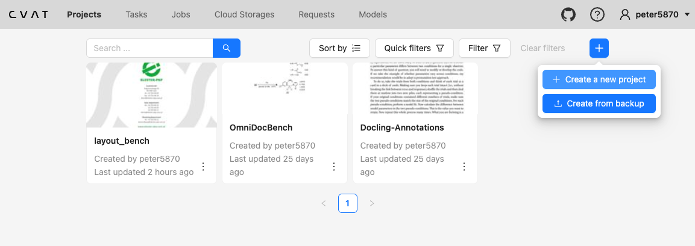
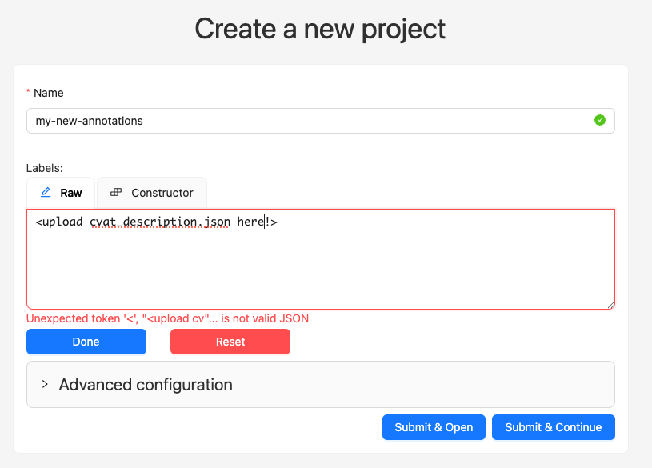
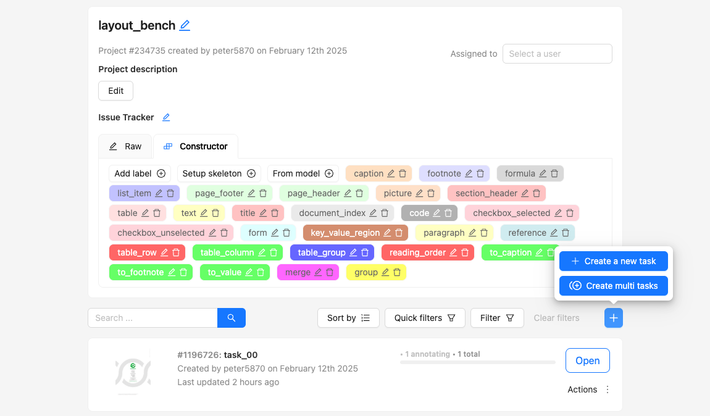
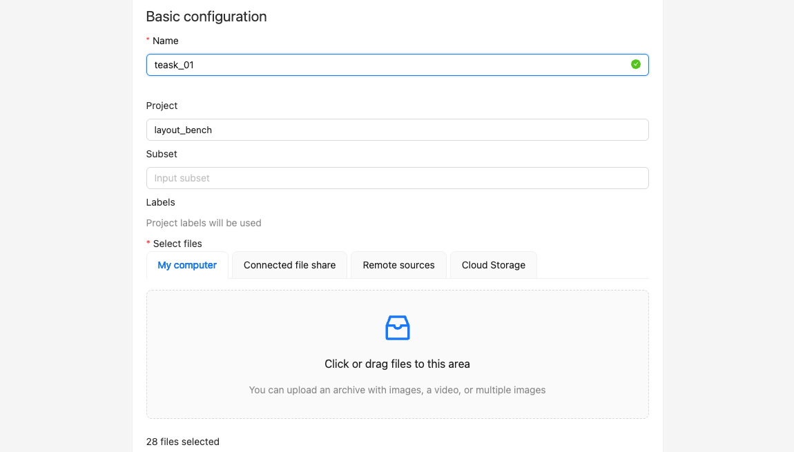
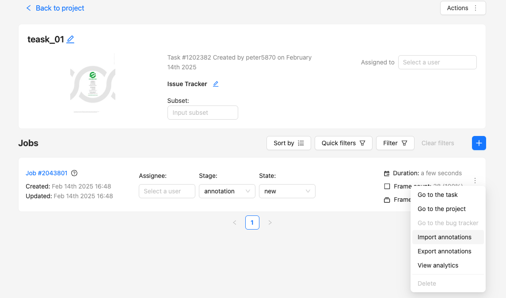
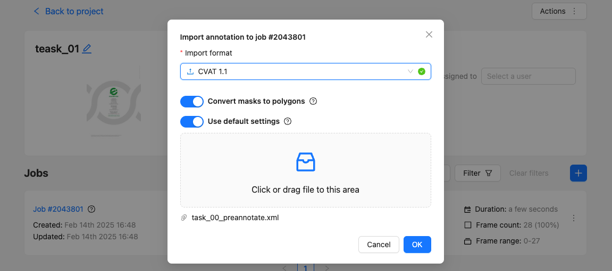
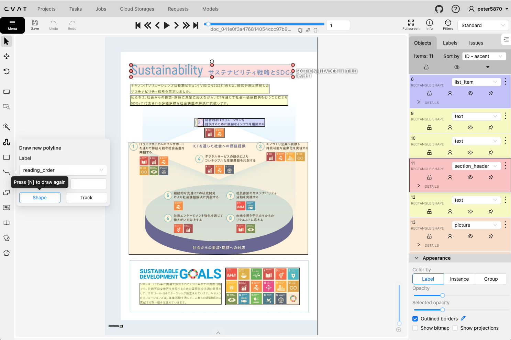
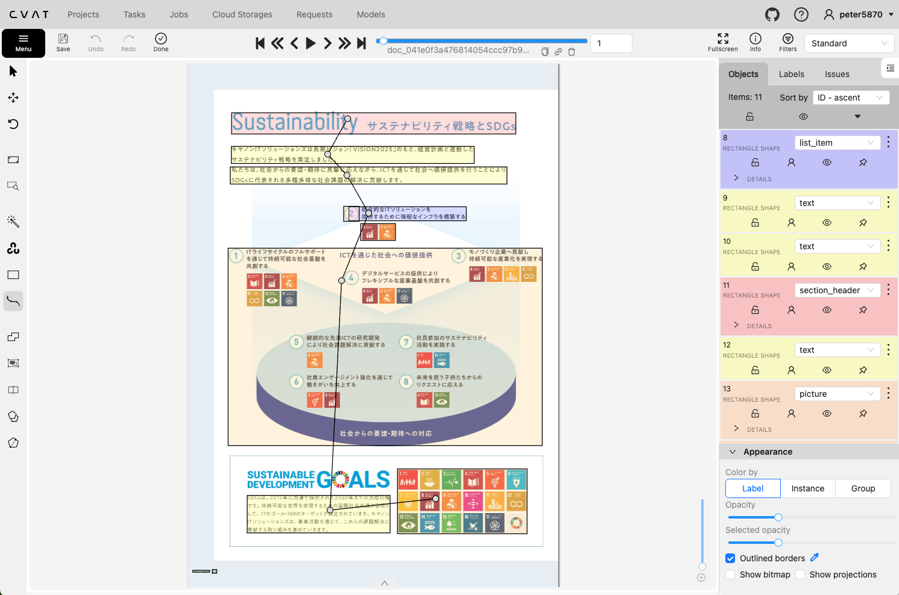
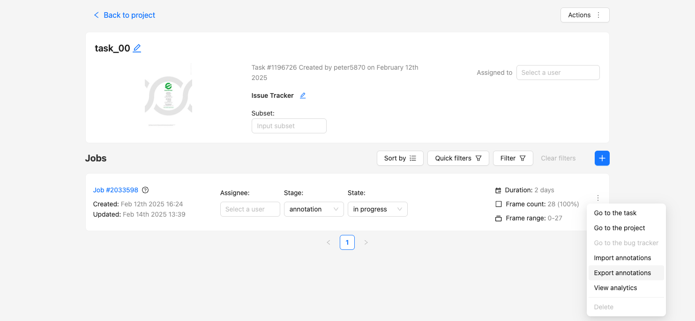

# Creating Groundtruth dataset using the CVAT annotation tool

## Prerequisites: create dataset in parquet

To start creating ground-truth, you first need to have a dataset in parquet format.
The most straightforward way is to use an existing dataset (e.g. DPBench), which comes with pre-annotated tables, formulas, etc. Hence, you can run the create script of that particular benchmark.

```sh
# Make the ground-truth
docling_eval create-gt --benchmark DPBench --output-dir ./benchmarks/DPBench-GT/ 
```

## Pre-annotation with Docling

Now you can create the files you need to upload to [CVAT](https://www.cvat.ai/). These files will be created using the `create-cvat` function of the `docling_eval` CLI.

```sh
❯ docling_eval create-cvat --help
                                                                                                                                                                    
 Usage: docling_eval create-cvat [OPTIONS]                                                                                                                          
                                                                                                                                                                    
╭─ Options ────────────────────────────────────────────────────────────────────────╮
│ *  --output-dir         PATH     Output directory [default: None] [required]     │
│ *  --gt-dir             PATH     Dataset source path [default: None] [required]  │
│    --bucket-size        INTEGER  Size of CVAT tasks [default: 20]                │
│    --help                        Show this message and exit.                     │
╰──────────────────────────────────────────────────────────────────────────────────╯
```

For example, try:
```sh
docling_eval create-cvat \ 
   --gt-dir ./benchmarks/DPBench-GT/gt_dataset/test/ \
   --output-dir ./benchmarks/DPBench-CVAT/
```

In essence, this will read the parquet files and set up a new directory structure (designated output) that has the following layout,

```sh
./legacy/<output-dir>
├── cvat_annotations
│   ├── xmls
│   └── zips
├── cvat_description.json
├── cvat_overview.json
├── cvat_bins
├── cvat_tasks
│   └── task_00
├── datasets
│   ├── test
│   └── train
├── html_annotations
├── html_comparisons
├── json_annotations
├── json_groundtruth
└── page_imgs
```

The definition of the annotation items (DocItemLabel and Lines) can be found in `cvat_description.json`. All the other data you need is in the `cvat_tasks`,

```
tree ./benchmarks/layout_bench_cvat/cvat_tasks
./benchmarks/layout_bench_cvat/cvat_tasks
├── task_00
│   ├── doc_03f0ba705b60a81144dd4669945f41e9ce1d5a399ee671f7e95ee15a73f3388b_page_000001.png
│   ├── doc_041e0f3a476814054ccc97b9dcecd6e46fef2a687297cf2bcbe0f3d1d42c543c_page_000001.png
...
│   └── doc_f85bda78041c552c58faa1c83d9bb5cf48265fbe96330c4476e4b75725c0c71a_page_000001.png
└── task_00_preannotate.xml
``` 

Here we have,

1. the page-images in `task_<xx>`
2. the annotations for each page-image in xml

## Online Annotation


<table style="width: 100%;">
<tr>
<td style="width: 20%;">To start annotating, go to the [CVAT](cvat.ai) and create a new project,</td>
<td style="width: 80%;"></td>
</tr>
<tr>
<td style="width: 20%;">Next, you give the project a name and upload the content of `cvat_description.json` into the Raw labels.</td> 
<td style="width: 80%;"></td>
</tr>
<tr>
<td style="width: 20%;">Next, click `Submit & Open`. This will open a new window in which you can create new tasks</td> 
<td style="width: 80%;"></td>
</tr>
<tr>
<td style="width: 20%;">Next you upload the images you want to annotate from the `cvat_tasks/task_<xx>` and click `Submit & Open`.</td>
<td style="width: 80%;"></td>
</tr>
<tr>
<td style="width: 20%;">Next, you can upload the pre-annotations for the taks,</td>
<td style="width: 80%;"></td>
</tr>
<tr>
<td style="width: 20%;">and you upload the CVAT annotations in xml,</td>
<td style="width: 80%;"></td>
</tr>
<tr>
<td style="width: 20%;">Finally, you are ready to annotate (click on `#Job <xxx>`) and the annotation window opens up,</td>
<td style="width: 80%;"></td>
</tr>
<tr>
<td style="width: 20%;">Make sure you adjust the bounding boxes, labels and add the reading-order line. The Reading order is simply a line of points, that have to fall inside the bounding-boxes,</td>
<td style="width: 80%;"></td>
</tr>
</table>

## Packaging the annotations into new dataset

After you have annotated all images, you can export the annotations,



You move the zip file into `cvat_annotations/zips` and then run the `create-gt` CLI function. For example:
```shell
docling_eval create-gt \
  --benchmark CVAT \
  --output-dir ./benchmarks/DPBench-CVAT-GT/ \
  --dataset-source ./benchmarks/DPBench-CVAT/
```

This should do all the heavy lifting for you.
