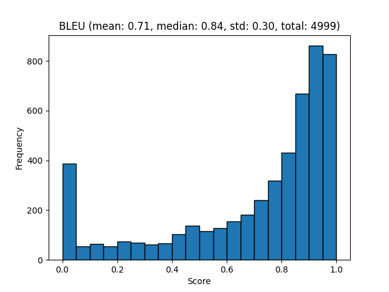
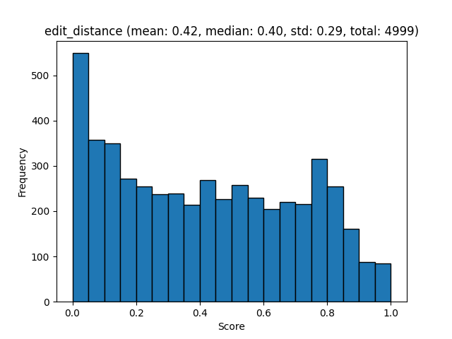
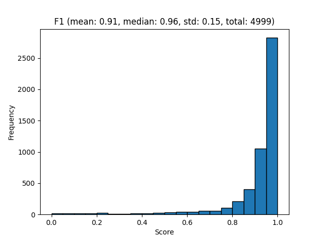
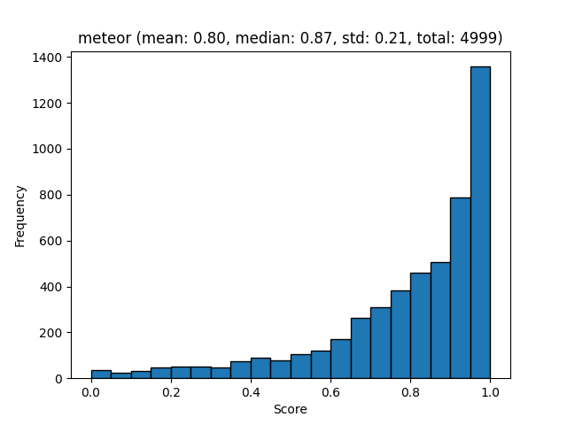
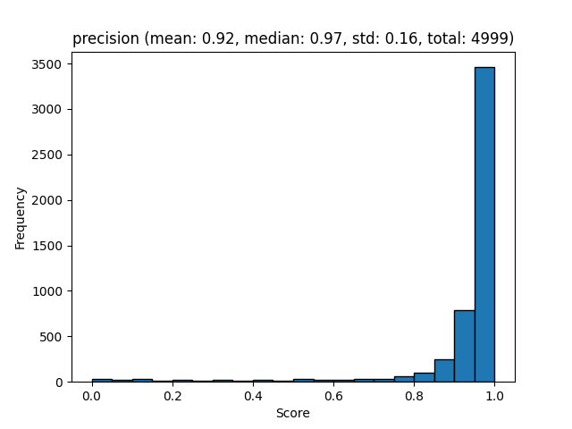
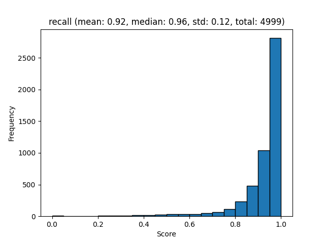

# DocLayNet V1.2 Benchmarks

Create and evaluate DocLayNetv1.2 datasets using the following commands. This downloads the [DocLayNetv1.2_OTSL](https://huggingface.co/datasets/ds4sd/DocLayNet-v1.2) from HuggingFace and runs the evaluations using the PDF Docling converter for all supported modalities.

Create evaluation datasets
```sh
# Make the ground-truth
docling_eval create-gt --benchmark DocLayNetV1 --output-dir ./benchmarks/DocLayNetV1/ 

# Make predictions for different modalities.
docling_eval create-eval \
  --benchmark DocLayNetV1 \
  --output-dir ./benchmarks/DocLayNetV1/ \
  --prediction-provider docling # use full-document predictions from docling
  
docling_eval create-eval \
  --benchmark DPBench \
  --output-dir ./benchmarks/DocLayNetV1/ \
  --prediction-provider tableformer # use tableformer predictions only
```


## Layout Evaluation

Create the evaluation report:

```sh
docling_eval evaluate \
  --modality layout \
  --benchmark DocLayNetV1 \
  --output-dir ./benchmarks/DocLayNetV1/ 

```

[Layout evaluation json](evaluations/DocLayNetV1/evaluation_DocLayNetV1_layout.json)

Visualize the report:

```sh
docling_eval visualize \
  --modality layout \
  --benchmark DocLayNetV1 \
  --output-dir ./benchmarks/DocLayNetV1/ 
```

[mAP[0.5:0.95] report](evaluations/DocLayNetV1/evaluation_DocLayNetV1_layout_mAP_0.5_0.95.txt)

![mAP[0.5:0.95] plot](evaluations/DocLayNetV1/evaluation_DocLayNetV1_layout_mAP_0.5_0.95.png)


## Markdown text Evaluation

Create the report:

```sh
docling_eval evaluate \
  --modality markdown_text \
  --benchmark DocLayNetV1 \
  --output-dir ./benchmarks/DocLayNetV1/ 
```

[Markdown text json](evaluations/DocLayNetV1/evaluation_DocLayNetV1_markdown_text.json)


Visualize the report:

```sh
docling_eval visualize \
  --modality markdown_text \
  --benchmark DocLayNetV1 \
  --output-dir ./benchmarks/DocLayNetV1/ 
```

[Markdown text report](evaluations/DocLayNetV1/evaluation_DocLayNetV1_markdown_text.txt)













