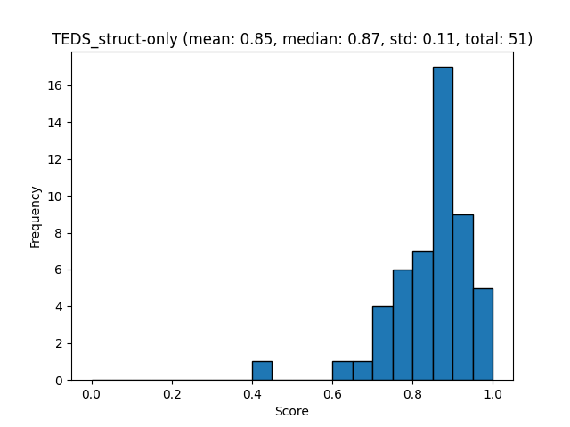
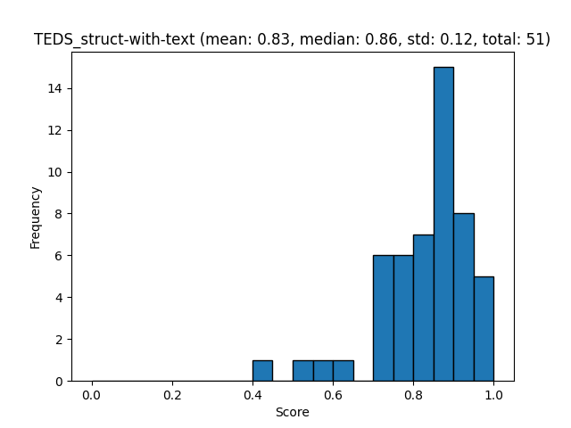
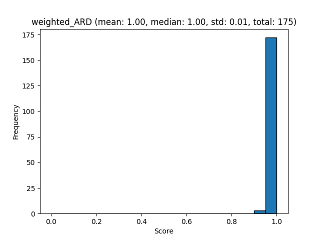
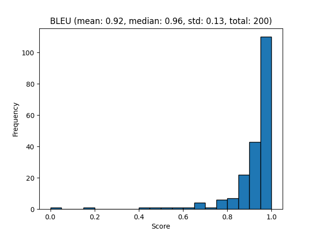
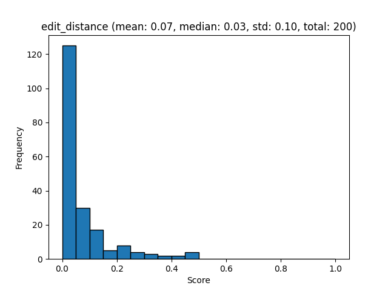
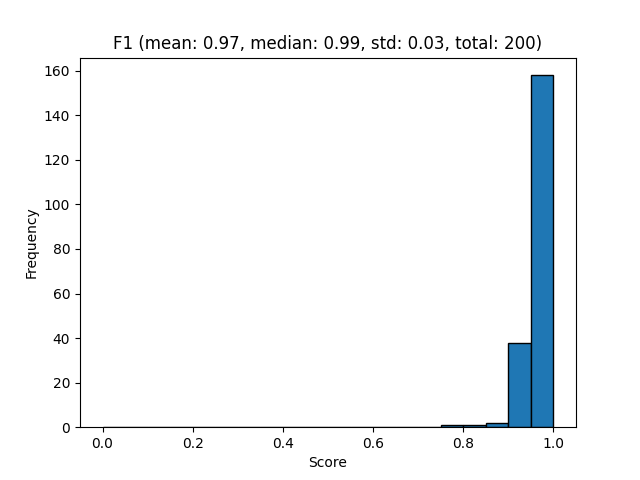
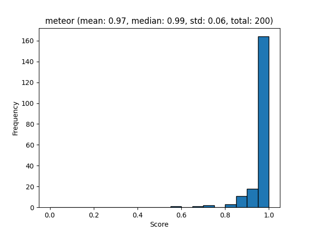
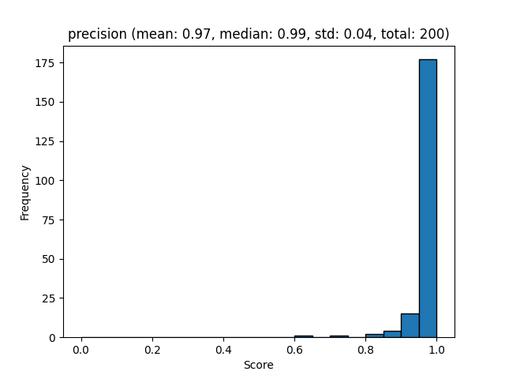
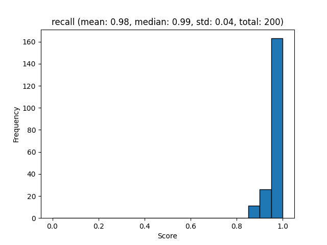

# Docling-DP-Bench Benchmarks

[Docling-DP-Bench on HuggingFace](https://huggingface.co/datasets/ds4sd/docling-dpbench)
Docling-DP-Bench is a re-annotated version of the original `upstage/dpbench` dataset with Docling-native labels.

Create Docling-DPBench evaluation datasets:

```sh
# Download the GT straight from HuggingFace
huggingface-cli download --repo-type dataset --local-dir ./benchmarks/Docling-DPBench-gt/gt_dataset ds4sd/docling-dpbench
# Make predictions for different modalities.
docling_eval create-eval \
  --benchmark DPBench \
  --gt-dir ./benchmarks/Docling-DPBench-gt/gt_dataset/ \
  --output-dir ./benchmarks/Docling-DPBench-e2e/ \
  --prediction-provider docling # use full-document predictions from docling
  
docling_eval create-eval \
  --benchmark DPBench \
  --gt-dir ./benchmarks/Docling-DPBench-gt/gt_dataset/ \
  --output-dir ./benchmarks/Docling-DPBench-tables/ \
  --prediction-provider tableformer # use tableformer predictions only
```

## Layout Evaluation

Create the evaluation report:

```sh
docling_eval evaluate \
  --modality layout \
  --benchmark DPBench \
  --output-dir ./benchmarks/Docling-DPBench-e2e/ 

```

[Layout evaluation json](evaluations/Docling-DPBench/evaluation_DPBench_layout.json)

Visualize the report:

```sh
docling_eval visualize \
  --modality layout \
  --benchmark DPBench \
  --output-dir ./benchmarks/Docling-DPBench-e2e/ 
```

[mAP[0.5:0.95] report](evaluations/Docling-DPBench/evaluation_DPBench_layout_mAP_0.5_0.95.txt)

![mAP[0.5:0.95] plot](evaluations/Docling-DPBench/evaluation_DPBench_layout_mAP_0.5_0.95.png)


## TableFormer Evaluation

Create the evaluation report:

```sh
docling_eval evaluate \
  --modality table_structure \
  --benchmark DPBench \
  --output-dir ./benchmarks/Docling-DPBench-tables/ 
```


Visualize the report:

[Tableformer evaluation json](evaluations/Docling-DPBench/evaluation_DPBench_tableformer.json)

Visualize the report:

```sh
docling_eval visualize \
  --modality table_structure \
  --benchmark DPBench \
  --output-dir ./benchmarks/Docling-DPBench-tables/ 
```




[TEDS struct only report](evaluations/Docling-DPBench/evaluation_DPBench_table_structure_TEDS_struct-only.txt)



[TEDS struct with text report](evaluations/Docling-DPBench/evaluation_DPBench_table_structure_TEDS_struct-with-text.txt)


## Reading order Evaluation

Create the evaluation report:

```sh
docling_eval evaluate \
  --modality reading_order \
  --benchmark DPBench \
  --output-dir ./benchmarks/Docling-DPBench-e2e/ 
```

[Reading order json](evaluations/Docling-DPBench/evaluation_DPBench_reading_order.json)

Visualize the report:

```sh
docling_eval visualize \
  --modality reading_order \
  --benchmark DPBench \
  --output-dir ./benchmarks/Docling-DPBench-e2e/ 
```


[ARD report](evaluations/Docling-DPBench/evaluation_DPBench_reading_order_ARD_norm.txt)



[Weighted ARD report](evaluations/Docling-DPBench/evaluation_DPBench_reading_order_weighted_ARD.txt)


## Markdown text Evaluation

Create the evaluation report:

```sh
docling_eval evaluate \
  --modality markdown_text \
  --benchmark DPBench \
  --output-dir ./benchmarks/Docling-DPBench-e2e/ 
```

[Markdown text json](evaluations/Docling-DPBench/evaluation_DPBench_markdown_text.json)


Visualize the report:

```sh
docling_eval visualize \
  --modality markdown_text \
  --benchmark DPBench \
  --output-dir ./benchmarks/Docling-DPBench-e2e/ 
```


[Markdown text report](evaluations/Docling-DPBench/evaluation_DPBench_markdown_text.txt)













