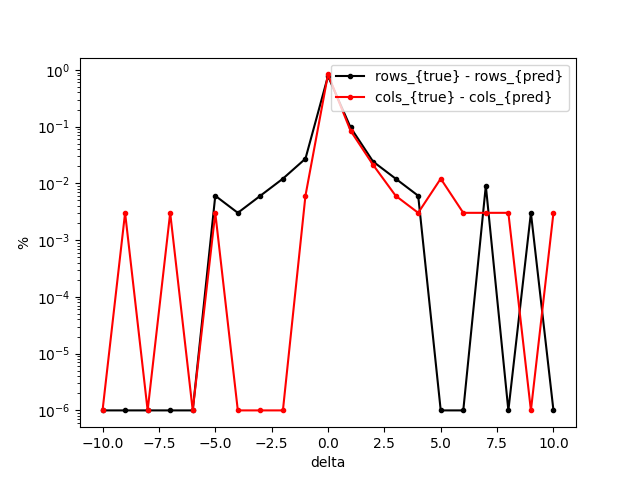
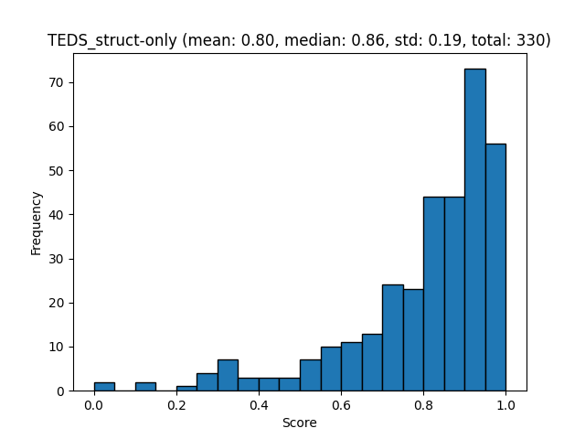
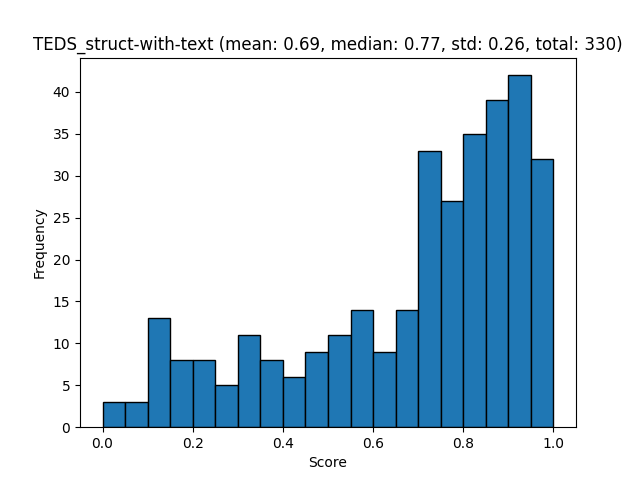
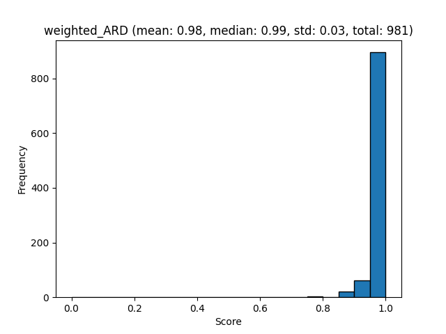
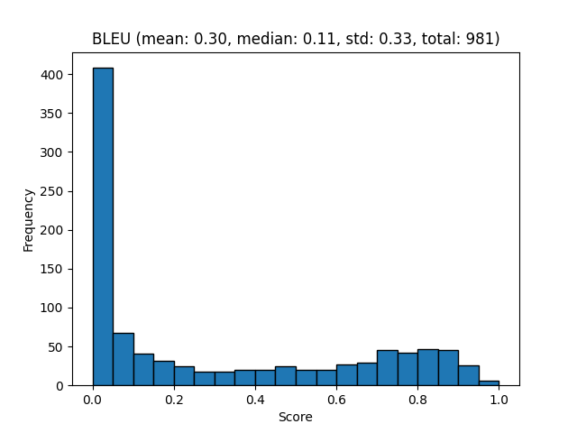
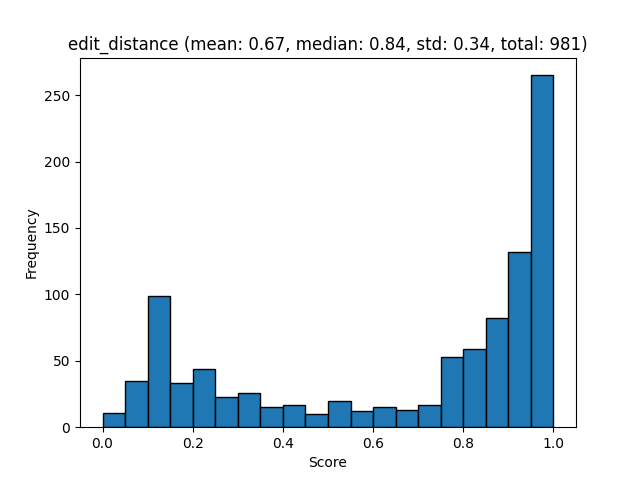
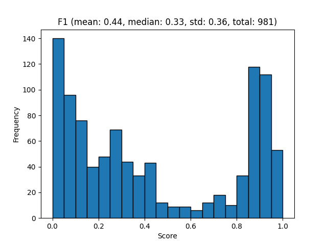
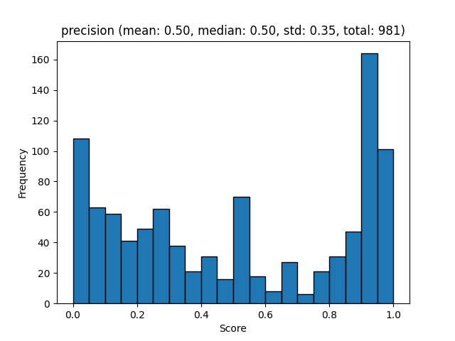
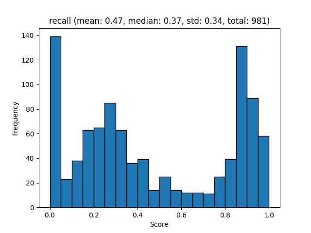

# OmniDocBench Benchmarks

[OmniDocBench on HuggingFace](https://huggingface.co/datasets/opendatalab/OmniDocBench)

Create OmniDocBench evaluation datasets:

```sh
# Make the ground-truth
docling_eval create-gt --benchmark OmniDocBench --output-dir ./benchmarks/OmniDocBench-gt/ 

# Make predictions for different modalities.
docling_eval create-eval \
  --modality end-to-end \
  --benchmark OmniDocBench \
  --gt-dir ./benchmarks/OmniDocBench-gt/ \
  --output-dir ./benchmarks/OmniDocBench-e2e/ \
  --prediction-provider docling # use full-document predictions from docling
  
docling_eval create-eval \
  --modality table_structure \
  --benchmark DPBench \
  --gt-dir ./benchmarks/OmniDocBench-gt/ \
  --output-dir ./benchmarks/OmniDocBench-tables/ \
  --prediction-provider tableformer # use tableformer predictions only
```

## Layout Evaluation

Create the evaluation report:

```sh
docling_eval evaluate \
  --modality layout \
  --benchmark OmniDocBench \
  --output-dir ./benchmarks/OmniDocBench-e2e/ 

```

[Layout evaluation json](evaluations/OmniDocBench/evaluation_OmniDocBench_layout.json)

Visualize the report:

```sh
docling_eval visualize \
  --modality layout \
  --benchmark OmniDocBench \
  --output-dir ./benchmarks/OmniDocBench-e2e/ 
```

[mAP[0.5:0.95] report](evaluations/OmniDocBench/evaluation_OmniDocBench_layout_mAP_0.5_0.95.txt)

![mAP[0.5:0.95] plot](evaluations/OmniDocBench/evaluation_OmniDocBench_layout_mAP_0.5_0.95.png)


## Tableformer Evaluation

Create the evaluation report:

```sh
docling_eval evaluate \
  --modality table_structure \
  --benchmark OmniDocBench \
  --output-dir ./benchmarks/OmniDocBench-tables/ 
```

[Tableformer evaluation json](evaluations/OmniDocBench/evaluation_OmniDocBench_tableformer.json)


Visualize the report:

```sh
docling_eval visualize \
  --modality table_structure \
  --benchmark OmniDocBench \
  --output-dir ./benchmarks/OmniDocBench-tables/ 
```





[TEDS struct only report](evaluations/OmniDocBench/evaluation_OmniDocBench_tableformer_TEDS_struct-only.txt)



[TEDS struct with text report](evaluations/OmniDocBench/evaluation_OmniDocBench_tableformer_TEDS_struct-with-text.txt)


## Reading order Evaluation

Create the evaluation report:

```sh
docling_eval evaluate \
  --modality reading_order \
  --benchmark OmniDocBench \
  --output-dir ./benchmarks/OmniDocBench-e2e/ 
```

[Reading order json](evaluations/OmniDocBench/evaluation_OmniDocBench_reading_order.json)


Visualize the report:

```sh
docling_eval visualize \
  --modality reading_order \
  --benchmark OmniDocBench \
  --output-dir ./benchmarks/OmniDocBench-e2e/ 
```

[ARD report](evaluations/OmniDocBench/evaluation_OmniDocBench_reading_order_ARD_norm.txt)

[Weighted ARD report](evaluations/OmniDocBench/evaluation_OmniDocBench_reading_order_weighted_ARD.txt)





## Markdown text evaluation

Create the evaluation report:

```sh
docling_eval evaluate \
  --modality markdown_text \
  --benchmark OmniDocBench \
  --output-dir ./benchmarks/OmniDocBench-e2e/ 
```

[Markdown text json](evaluations/OmniDocBench/evaluation_OmniDocBench_markdown_text.json)


Visualize the report:

```sh
docling_eval visualize \
  --modality markdown_text \
  --benchmark OmniDocBench \
  --output-dir ./benchmarks/OmniDocBench-e2e/ 
```

[Markdown text report](evaluations/OmniDocBench/evaluation_OmniDocBench_markdown_text.txt)











