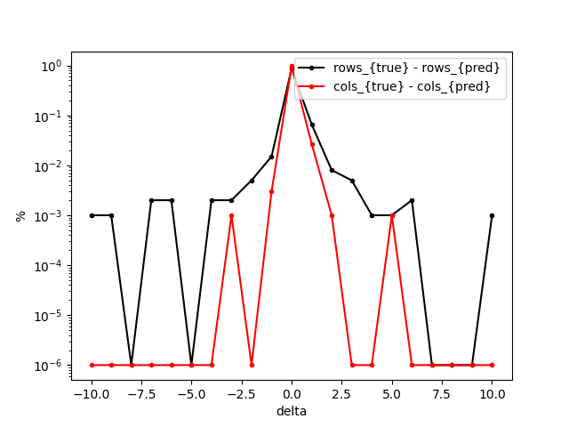
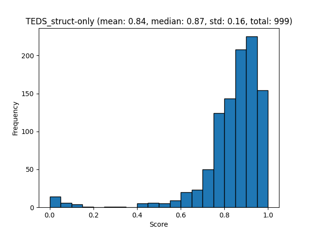
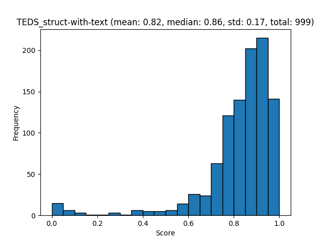

# Pub1M Benchmarks

Create and evaluate Pub1M dataset using a single command. This command downloads from Huggingface the [Pub1M_OTSL](https://huggingface.co/datasets/ds4sd/Pub1M_OTSL) and runs the evaluations for TableFormer using the first 1000 samples. 

```sh
poetry run python docs/examples/benchmark_p1m.py
```

## Layout Evaluation

Create the evaluation report:

```sh
poetry run evaluate \
    -t evaluate \
    -m tableformer \
    -b Pub1M \
    -i benchmarks/Pub1M-dataset/tableformer \
    -o benchmarks/Pub1M-dataset/tableformer
```

[Tableformer evaluation json](evaluations/Pub1M/evaluation_Pub1M_tableformer.json)

Visualize the report:

```sh
poetry run evaluate \
    -t visualize \
    -m tableformer \
    -b Pub1M \
    -i benchmarks/Pub1M-dataset/tableformer \
    -o benchmarks/Pub1M-dataset/tableformer
```





[TEDS struct only report](evaluations/Pub1M/evaluation_Pub1M_tableformer_TEDS_struct-only.txt)



[TEDS struct with text report](evaluations/Pub1M/evaluation_Pub1M_tableformer_TEDS_struct-with-text.txt)
