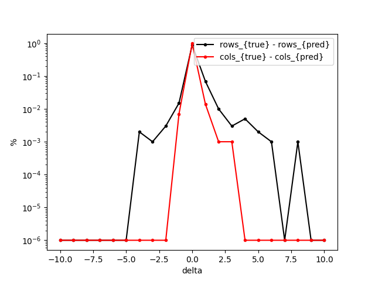
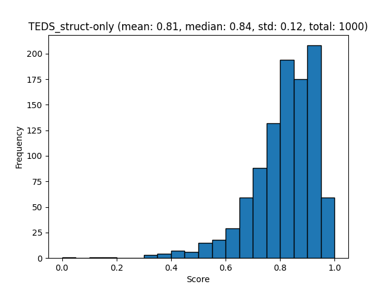
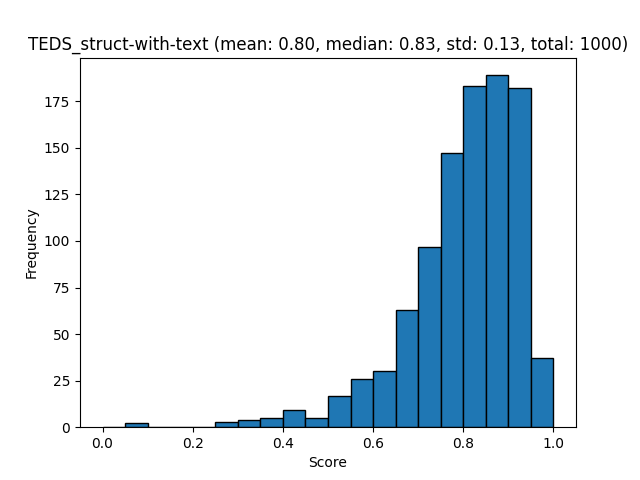

# PubTabNet Benchmarks

Create PubTabNet evaluation datasets. This downloads from Huggingface the [PubTabNet_OTSL dataset](https://huggingface.co/datasets/ds4sd/Pubtabnet_OTSL) and runs the evaluations for TableFormer using the first 1000 samples.

```sh
# Make the ground-truth
docling_eval create-gt --benchmark PubTabNet --split val --output-dir ./benchmarks/PubTabNet/ 

# Make predictions for tables.
docling_eval create-eval \
  --benchmark PubTabNet \
  --split val \
  --output-dir ./benchmarks/PubTabNet/ \
  --end-index 1000 \
  --prediction-provider tableformer # use tableformer predictions only
```

## Tableformer Evaluation

Create the evaluation report:

```sh
docling_eval evaluate \
  --modality table_structure \
  --benchmark PubTabNet \
  --output-dir ./benchmarks/PubTabNet/ 
```

[Tableformer evaluation json](evaluations/PubTabNet/evaluation_PubTabNet_tableformer.json)

Visualize the report:

```sh
docling_eval visualize \
  --modality table_structure \
  --benchmark PubTabNet \
  --output-dir ./benchmarks/PubTabNet/ 
```





[TEDS struct only report](evaluations/PubTabNet/evaluation_PubTabNet_tableformer_TEDS_struct-only.txt)



[TEDS struct with text report](evaluations/PubTabNet/evaluation_PubTabNet_tableformer_TEDS_struct-with-text.txt)

